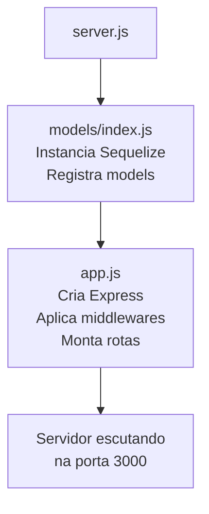
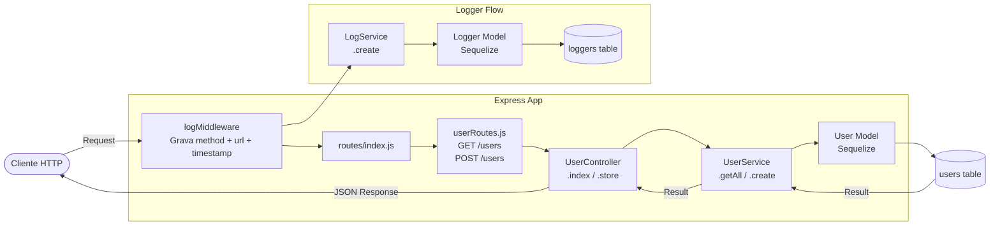

# 🗂️ Projeto Pessoal — API REST Node.js

API REST construída com **Node.js + Express + Sequelize + PostgreSQL**, seguindo arquitetura **MVC** com separação clara de responsabilidades.

---

## 📦 Tecnologias

| Tecnologia | Uso |
|------------|-----|
| Node.js | Runtime JavaScript |
| Express | Framework HTTP |
| Sequelize | ORM para PostgreSQL |
| PostgreSQL | Banco de dados relacional |
| bcrypt | Hash de senhas |
| dotenv | Gerenciamento de variáveis de ambiente |

---

## 🏗️ Estrutura do Projeto

```
src/
├── app.js                     # Inicialização do Express, middlewares e rotas
├── server.js                  # Entry point — inicializa DB e sobe o servidor
├── config/
│   └── database.js            # Config do Sequelize via variáveis de ambiente
├── database/
│   ├── migrations/            # Migrations Sequelize
│   └── seeders/               # Seeders Sequelize
├── middlewares/
│   └── logMiddleware.js       # Intercepta todas as requisições e grava log
├── models/
│   ├── index.js               # Instancia o Sequelize e registra todos os models
│   ├── User.js                # Model de usuário (id, name, email, password_hash)
│   └── Logger.js              # Model de log (method, url, timestamp)
├── controllers/
│   └── UserController.js      # Handlers HTTP de usuários (index, store)
├── routes/
│   ├── index.js               # Agrega todas as rotas da aplicação
│   └── userRoutes.js          # Rotas do módulo de usuários
└── services/
    ├── UserService.js         # Regras de negócio de usuários
    └── LogService.js          # Regras de negócio de logs
```

---

## 🔄 Fluxo da Aplicação

### Boot do Servidor



### Fluxo de uma Requisição HTTP



---

## 📋 Endpoints Disponíveis

### Users

| Método | Endpoint | Descrição | Body | Response |
|--------|----------|-----------|------|----------|
| GET | `/users` | Lista todos os usuários | — | `[{ id, name, email, created_at }]` |
| POST | `/users` | Cria novo usuário | `{ name, email, password }` | `{ id, name, email, created_at }` |

---

## 🗃️ Models

### User

| Campo | Tipo | Restrições | Observação |
|-------|------|-----------|------------|
| `id` | INTEGER | PK, Auto Increment | |
| `name` | STRING | NOT NULL | |
| `email` | STRING | NOT NULL, UNIQUE, isEmail | |
| `password_hash` | STRING | NOT NULL | Hash bcrypt gerado no `beforeCreate` |
| `created_at` | DATE | Auto (timestamps) | |
| `updated_at` | DATE | Auto (timestamps) | |

### Logger

| Campo | Tipo | Restrições | Observação |
|-------|------|-----------|------------|
| `id` | INTEGER | PK, Auto Increment | |
| `method` | STRING | NOT NULL | Ex: `GET`, `POST` |
| `url` | STRING | NOT NULL | URL da requisição |
| `timestamp` | DATE | NOT NULL | Momento exato da requisição |
| `created_at` | DATE | Auto | |
| `updated_at` | DATE | Auto | |

---

## 🔒 Segurança

- Senhas **nunca armazenadas em texto puro** — hook `beforeCreate` aplica `bcrypt.hash(password, 8)` antes de persistir
- Credenciais do banco **exclusivamente via variáveis de ambiente** (`.env`) — nunca hardcoded
- O arquivo `.env` está no `.gitignore` e **não é versionado**

---

## ⚙️ Variáveis de Ambiente

Crie um arquivo `.env` na raiz do projeto:

```env
PORT=3000
DB_USER=seu_usuario
DB_PASSWORD=sua_senha
DB_NAME=nome_do_banco
DB_HOST=localhost
DB_PORT=5432
```

---

## 🚀 Como Rodar

```bash
# Instalar dependências
npm install

# Rodar migrations
npx sequelize-cli db:migrate

# Iniciar servidor em desenvolvimento
npm run dev
```

---

## 🗺️ Roadmap

- [x] Módulo de Users (CRUD base)
- [x] Sistema de Logger automático por middleware
- [ ] Migrations das tabelas `users` e `loggers`
- [ ] Módulo de Habits (rastreamento de hábitos)
- [ ] Módulo de Expenses (gestão de despesas pessoais)
- [ ] Autenticação JWT
- [ ] Validações de entrada (Yup / Joi)
